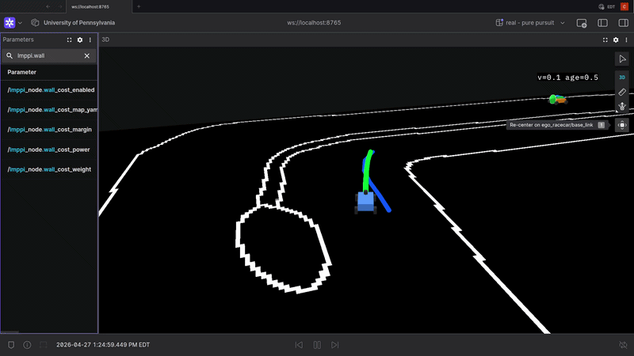
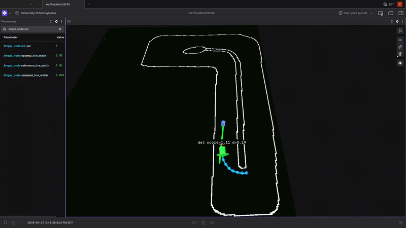
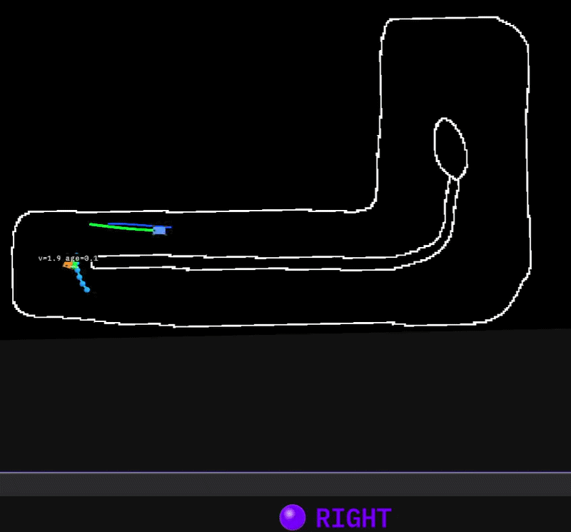
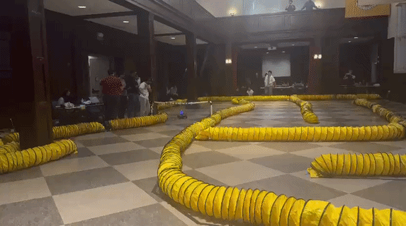
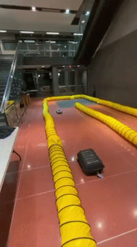
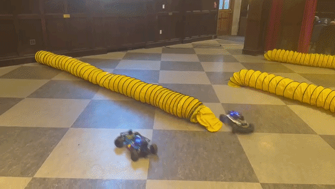
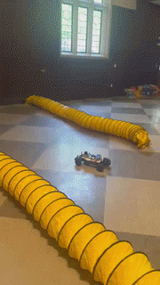
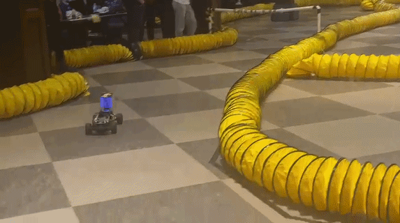

# Opponent-Aware MPPI for F1TENTH Racing

ROS 2 packages running a JAX-based MPPI controller for aggressive raceline
tracking, opponent-aware avoidance, and overtaking on F1TENTH cars (sim +
real hardware on a Jetson Orin Nano). Built on
[mlab-upenn/mppi_example](https://github.com/mlab-upenn/mppi_example)
(MIT, © 2025 xLab for Safe Autonomous Systems).

This repo was used for both the **final race** and **final project**
for ESE 6150 (UPenn, Spring 2026).

## Team 5 Thunderbolt

- Cedric Hollande - [@cedrichld](https://github.com/cedrichld)
- Zach Rudder - [@zachrudder](https://github.com/zachrudder)
- Maanasa Rajeshwer - [@MaanaRajesh](https://github.com/MaanaRajesh)
- Boyuan Yang - [@yang50-guaidao](https://github.com/yang50-guaidao)

## Demo

### Sim

<table>
  <tr>
    <td align="center"><b>Raceline tracking</b></td>
    <td align="center"><b>Overtaking a stationary obstacle</b></td>
  </tr>
  <tr>
    <td align="center"></td>
    <td align="center"></td>
  </tr>
  <tr>
    <td align="center"><b>Following / avoiding a moving opponent</b></td>
    <td align="center"><b>Closer overtake clip</b></td>
  </tr>
  <tr>
    <td align="center"></td>
    <td align="center"></td>
  </tr>
</table>

### Hardware

<table>
  <tr>
    <td align="center" colspan="2"><b>Race start</b></td>
  </tr>
  <tr>
    <td align="center" colspan="2"></td>
  </tr>
  <tr>
    <td align="center"><b>Static obstacle avoidance (Levine)</b></td>
    <td align="center"><b>Dynamically avoiding a moving target</b></td>
  </tr>
  <tr>
    <td align="center"></td>
    <td align="center"></td>
  </tr>
  <tr>
    <td align="center"><b>Avoiding several cars on the track</b></td>
    <td align="center"><b>Race-day overtake</b></td>
  </tr>
  <tr>
    <td align="center"></td>
    <td align="center"></td>
  </tr>  
</table>

> Long-form video: [YouTube - MPPI Project Demo Levine](https://youtu.be/NFLvNrOb9cU), [YouTube - MPPI Project Demo Houston](https://youtube.com/shorts/2QTc-SeHTgE?si=4ut7kjXXJcAOgV-o) - longer clips in [`media/hardware_videos/`](media/hardware_videos)

---

## TL;DR

Sample-based predictive controller in JAX:
- **Our setup**: **8192** rollout samples × **8-step** horizon (0.8s lookahead) at **40 Hz** on a Jetson Orin Nano
- Pose-driven trigger so the executor can never starve odom ingestion behind a continuously-ready timer
- Reward: xy + velocity + yaw tracking against a moving raceline reference
- Cost: wall SDF + opponent radial repulsion + (optional) slip / latacc / steer-saturation
- Live raceline hot-swap via service (no node restart) - driven from the
  [raceline_UI_f1tenth](https://github.com/cedrichld/raceline_UI_f1tenth) web app
- Opponent prediction via a separate C++ pipeline that maintains a Kalman filter on
  `(s, v)` along the raceline arclength → fed to MPPI as a cost field

---

## How it works

At every control step the planner samples **N = 8192** control sequences
$U^{(i)} = u_0^{(i)}, \dots, u_{H-1}^{(i)}$ around a nominal sequence
$\bar U$, rolls each one through a JAX-vmapped vehicle model over horizon
$H = 8$ steps (sim_time_step = 0.1 s → 0.8 s lookahead), and scores the
resulting trajectories. The score combines tracking rewards
(xy, yaw, velocity vs. raceline) with cost terms for wall proximity,
sideslip $\beta$, lateral acceleration, and steering saturation - each
toggleable from YAML.

Sample weights use the standard MPPI softmax with temperature $\lambda$:

$$w^{(i)} = \frac{\exp(R^{(i)} / \lambda)}{\sum_j \exp(R^{(j)} / \lambda)}, \qquad
\bar U \leftarrow \sum_i w^{(i)} U^{(i)}$$

Low $\lambda$ (≈ 0.01) makes the average winner-take-all (sensitive to noise);
higher $\lambda$ (≈ 0.10+) blurs decisive maneuvers. Race default: **0.05**.
Only the first action of $\bar U$ is published to `/drive`; the rest is
**shifted by one step and reused as the prior** for the next solve, so each
iteration warm-starts from the last solution instead of restarting from zero.

The reference trajectory (waypoints + per-waypoint target speeds) can be
swapped **live** via the `/mppi/update_raceline` ROS 2 service. This is
driven from the
[raceline_UI_f1tenth](https://github.com/cedrichld/raceline_UI_f1tenth) web
app, which lets you edit racelines and push them to the running controller
without restarting.

---

## Stack overview

```
   /scan ──► particle_filter (range_libc, 8K particles, ~50 Hz)
                 │
                 ▼
            /pf/pose/odom (50 Hz)
                 │
   ┌─────────────┴─────────────┐
   ▼                           ▼
opponent_predictor          mppi_node                ───►  /drive  (RELIABLE QoS)
(C++ KF on s, v)            (JAX MPPI, 40 Hz                       to f1tenth_stack
   │                         pose-driven trigger,                  ─► VESC
   ▼                         8K samples × 8 steps)
/opponent/predicted_path                                ◄── opp horizon
```

- **Localization:** `particle_filter` (cloned from `f1tenth/particle_filter`),
  8K particles, runs at ~50 Hz on cores 0,1,2 of the Jetson.
- **Controller:** `mppi_node` (in `mppi_example/`), JAX-based MPPI on cores 3,4,5.
- **Opponent perception:** `opponent_predictor` (C++) - clusters `/scan` returns,
  filters against the static map's wall SDF, projects detections onto the
  raceline arclength `s`, and runs a Kalman filter on `(s, v)`. Publishes a
  short-horizon prediction on `/opponent/predicted_path` that MPPI consumes
  as a cost field.

---

## Layout

- `mppi_example/` - controller. `mppi_node.py` (odom → `/drive`),
  `mppi_tracking.py` (JAX rollout loop), `dynamics_models/` (vehicle models).
- `mppi_bringup/` - launch files, params, waypoint CSVs, maps.
- `opponent_predictor/` - raceline-progress opponent prediction with
  Foxglove/RViz visualization and debug topics.
- `MPPI_SYSTEM_OVERVIEW.md` - deeper math + code map.
- `media/MPPI_GUIDE.md` - tuning notes.
- `IMPORTANT_DEBUG_MPPI.md` - race-day debugging cheat sheet.

---

## Build

External dependencies (install once):
- ROS 2 Humble
- JAX with CUDA (on Jetson, built from source against L4T's CUDA stack)
- `range_libc` from [f1tenth/range_libc](https://github.com/f1tenth/range_libc)
  (needs `nvcc` for `rmgpu`; CPU methods work without)
- `f1tenth_system` (provides `/drive` consumer + VESC bringup)

Build the workspace:

```bash
cd ~/ros2_ws/roboracer_ws
colcon build --symlink-install \
    --packages-select mppi_example mppi_bringup opponent_predictor particle_filter
source install/setup.bash
```

## Run - Sim
Clone f1tenth_gym_ros from. Then in parallel terminals:
[our dev-humble fork](https://github.com/cedrichld/f1tenth_gym_ros/tree/dev-humble).
```bash
ros2 launch f1tenth_gym_ros houston.launch.py
```
*Optionally for better simulation:*
```bash
ros2 launch particle_filter localize_launch.py 
```

Launch mppi. Override with
`params_file:=...` for a custom config.
*If not using PF, ensure use_sim param is set to true*
```bash
ros2 launch mppi_bringup sim_houston.launch.py
```

```bash
ros2 launch opponent_predictor lev_sim_opponent_predictor.launch.py
```

## Run - Hardware (Jetson)

Four terminals:

```bash
# 1. Bring up the car (lidar + VESC + joystick safety)
ros2 launch f1tenth_stack sick_bringup_launch.py

# 2. Particle filter localization
ros2 launch particle_filter localize_launch.py

# 3. MPPI controller
ros2 launch mppi_bringup houston_main1.launch.py

# 4. (Optional) Opponent prediction pipeline
ros2 launch opponent_predictor opp_pred.launch.py
```

### CPU core distribution (Jetson Orin Nano, 6 cores)

Run once at session start, after launching everything *(or have taskset before ros2 commands)*:

```bash
sudo taskset -cp 0-2 $(pgrep -f particle_filter)
sudo taskset -cp 3-5 $(pgrep -f mppi_node)
sudo taskset -cp 5   $(pgrep -f opponent_predictor)
```

| Cores | Process | Why |
|---|---|---|
| 0, 1, 2 | particle_filter | PF is multi-threaded, saturates 2-3 cores at 6K particles. Isolating it stops thread migration into the MPPI cores |
| 3, 4, 5 | mppi_node (Python + JAX dispatch) | Steady ~70% CPU; bursts during the JAX solve |
| 3, 4, 5 | lidar driver | SICK driver is light, kernel scheduler handles it fine |
| 5 (could also just be 3, 4, 5) | opponent_predictor + spillover | C++ pipeline is light, fits alongside MPPI tail work |

This isolation isn't strictly required (no SOFT timing gaps without it
once the Foxglove subscription bug was fixed) but it reduces the variance
on `solve_max` over long runs. The PF node takes however much CPU cores it is given, that's why it is nicer to pin it and let other processes breathe.

---

## Why config is healthy on a Jetson Orin Nano

For a battery-powered embedded device with a shared 7.4 GB CPU/GPU memory
pool and 6 ARM cores, this is a fairly aggressive config that still leaves
real headroom:

| Resource | Used | Available | Notes |
|---|---|---|---|
| CPU (PF) | 2-3 cores busy | 6 total | PF is the workhorse; rest of system is light |
| CPU (MPPI) | ~70% of 1 core avg | 2-3 cores reserved | Bursty during JAX solve, idle between |
| GPU compute | 5-25% utilization | RTX-class iGPU | MPPI solves in ~6 ms (mean), GPU is barely loaded |
| Unified memory | ~5.5 GB used | 7.4 GB total | ~750 MB free + 1.6 GB cached as buffer |
| Power draw | ~9.3 W VDD_IN | (battery-fed) | MAXN_SUPER mode |
| Thermals | 53-55 °C | Tj limit 105 °C | `cool` fan profile reacts on temp rise |

We run **8K MPPI samples (40Hz) + 8K PF particles (50Hz)** consistently with zero SOFT
timing gaps. The compute path can take more - solve mean stays ~6 ms even
at 8192 samples because JAX scales sub-linearly on GPU - but we found
**no measurable control improvement past ~8K samples**, and going higher
just eats memory

---

## Configuration that matters

All in [`mppi_bringup/config/params_houston_main.yaml`](mppi_bringup/config/params_houston_main.yaml).

**Solve shape (read-only at startup; restart node to change):**
```yaml
n_samples: 8192        # JAX rollout batch
n_steps: 8             # horizon length
sim_time_step: 0.1     # → 0.8s lookahead
control_loop_hz: 40.0  # rate gate (pose-driven dispatch caps at this rate)
control_trigger_mode: odom_gate   # "odom_gate" or "timer"
```

**Live-tunable (need `live_tuning_enabled: true`):**
```yaml
temperature: 0.05              # 0.01 = winner-take-all (jittery), 0.10+ = mushy
friction: 0.45                 # vehicle-model belief, NOT real friction
speed_profile_scale: 1.0       # multiplier on raceline target speeds
xy_reward_weight: 0.25         # tracking weight
velocity_reward_weight: 0.15   # speed-profile-following weight
wall_cost_enabled: true        # GPU-cheap, keep on as safety
opponent_cost_weight: 40.0
opponent_cost_radius: 0.6
opponent_behavior_mode: auto  # 'clear' = radial repulsion only;
                               # 'auto' is a WIP overtake state machine
```

**Defenses against subscriber-induced lag (the lesson we paid in races for):**
```yaml
viz_publish_rate_hz: 5.0       # caps marker/debug topic publish rate
publish_markers: false         # master switch for ALL marker work
live_tuning_enabled: false     # skip ~100 param reads at 2 Hz when off
```

Memory cap (in `mppi_example/infer_env.py`):
```python
os.environ["XLA_PYTHON_CLIENT_PREALLOCATE"] = "true"
os.environ["XLA_PYTHON_CLIENT_MEM_FRACTION"] = "0.40"  # 0.40 of 7.4 GB on Jetson
```

---

## Lessons learned

These are real things we got wrong and then fixed; they're worth knowing if
you build on this.

**Foxglove / RViz subscribers can flood the MPPI node and cause SOFT timing
gaps.** This was the single biggest debugging issue of our last 3 weeks in the course.
The moment a remote viz tool subscribed to debug topics
(`/mppi/optimal_trajectory`, `/mppi/reference_trajectory`, etc.) over SSH, MPPI started
dropping ticks. It was something hard to notice because we turned off visualization publishing but topics were still alive (publishing nothing), and somehow still corrupting the whole node. The fix is either don't visualize in rviz when running on the car or we tried these in the code after the race:
1. `viz_publish_rate_hz` (default 5 Hz) - caps the entire debug+viz block in
   `control_step` regardless of solve rate
2. `BEST_EFFORT` QoS on all debug topics - slow subscribers drop messages
   instead of backpressuring the publisher
3. Subscriber-count gates on every individual publish - skip the work if
   nobody's listening

`/drive` deliberately stays `RELIABLE` - the VESC needs every command or it won't be smooth.

**JAX on Jetson needs preallocation.** With `PREALLOCATE=false` (the JAX
default), the unified-memory allocator can fragment over a long race and
hit unexplained stalls. Setting `PREALLOCATE=true` with
`MEM_FRACTION=0.40` (~3 GB of the 7.4 GB pool) makes total memory usage
deterministic and fixed-budget. We saw a silent Jetson hang mid-race once
that we couldn't reproduce after this change.

**Particle count is important to avoid the inferred pose jumping around, and not visualizing particles in sim."**
Our compute at 3K particles noticeably diminished vs 4k particles but then on a bigger map, our PF's estimate was not reliable enough for racing.

**Sample count saturates faster than you'd expect.** Going 2048 -> 8192
samples on the GPU cost very little (JAX scales sub-linearly).

**Gate live param refresh.** The original code re-read 100+ ROS 2 params
inside the control loop callback; on Jetson this seemed to be slowing things down pretty seriously,
leading to soft timing gaps (probably amplified by foxglove parameters tab). 
Now there's a `live_tuning_enabled` flag,
default `false` for racing, so the 2 Hz refresh timer just reads one bool
per tick and returns.

**Battery state doesnt seem to matter too much.** The only issue might be that LiDAR performs less well, 
and Jetson of course as well, but since we managed our compute cleanly we didnt see much of an issue -
MPPI is robust once properly set up.

**Wall cost is essentially free, if there is no opponent it's better off though.** It's a single fixed-shape
GPU lookup into a precomputed signed distance field. Disabling it doesn't
save measurable compute and removes a real safety net. 
It's necessary once we try to avoid opponents but for pure raceline optimization, if you're trajectory and MPPI params
 tuning (temperature, stds etc.) is well done it's more 'perfect' in its trajectories.

**Don't simultaneously change six things between races.** Obvious in
hindsight. Bench-test single-variable changes; change one thing per round
on race day if you must.

---

## What we'd improve

- **Improve the auto-overtake state machine.** `opponent_behavior_mode: auto`
  has a `follow → pass_left | pass_right` FSM with hysteresis and clearance
  probes. We raced in `clear` (pure radial repulsion) because the FSM wasn't perfect and 
  often tried overtaking in the wrong spots in sim. With more sim time (shouldn't be long) it should give
  more decisive overtakes than the radial cost alone.
- **Pose-delta state estimator (vy, omega) more carefully tuned.** Currently uses
  an IIR on PF-pose deltas; works but could use a proper EKF/UKF.
- **Opponent Behavior Estimate.** Either through a learned model that predicts which behavior mode the 
  opponent will be in or something simple based on speed and position in track.
- **Trim the node further.** Currently ~2300 lines (a lot of params set up to tune nicely with 
  rqt_reconfigure). 

---

## Layout (file-level)

| Path | What it does |
|---|---|
| `mppi_example/mppi_example/mppi_node.py` | The ROS 2 node. Pose ingest, control_step, drive publish, viz publish |
| `mppi_example/mppi_example/mppi_tracking.py` | JAX rollout loop + softmax-weighted update |
| `mppi_example/mppi_example/infer_env.py` | Vehicle dynamics, cost / reward functions, wall SDF |
| `mppi_example/mppi_example/dynamics_models/` | Single-track and kinematic vehicle models in JAX |
| `mppi_bringup/launch/houston_main1.launch.py` | Hardware launch (race) |
| `mppi_bringup/launch/sim_houston.launch.py` | Sim launch |
| `mppi_bringup/config/params_houston_main.yaml` | Race-day params (the file you tune most) |
| `opponent_predictor/src/opponent_lidar_detector_node.cpp` | C++ scan clustering + raceline projection |
| `opponent_predictor/src/opponent_predictor_node.cpp` | C++ KF on `(s, v)` + horizon prediction |

---

## License

MIT: see [`LICENSE`](LICENSE). Includes upstream's MIT notice from xLab.

<p align="center">
  
</p>
